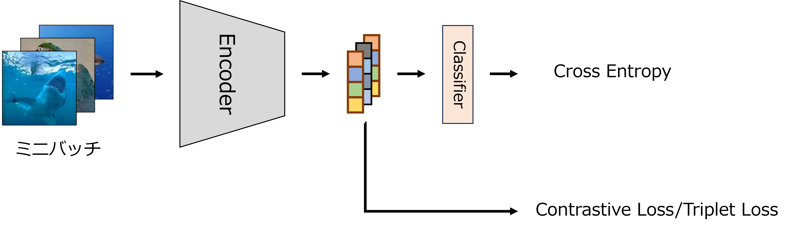
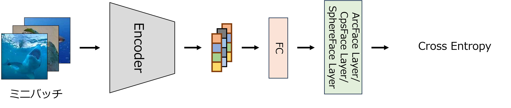

# Metric Learning Method
Metric Learningのサンプルコード

Siamese Network & Triplet Lossの学習の流れ


ArcFace ＆ CosFace & SphereFaceの学習の流れ


## ファイル＆フォルダ一覧

<details>
<summary>フォルダ</summary>
 
|ファイル名|説明|
|----|----|
|base_model|モデルが定義されたファイルが格納されたフォルダ．|
|Config|学習用のハイパーパラメータが記載されたConfigファイルが格納されたフォルダ．|
|fig|図のフォルダ．|
</details>

<details>
<summary>ファイル</summary>
 
|ファイル名|説明|
|----|----|
|method_config.py|Metric Learningの手法に対応したモデル，損失関数，Optimizerが定義されたコード．|
|metric_loss.py|Metric Learningの損失のコード．(Contrastive Loss，Triplet Loss，ArcFace，CosFace，SphereFaceが定義されている．)|
|metric_model.py|Metric Learningのモデルのコード．|
|train_metric.py|Metric Learningを導入したモデルを学習するコード．|
|trainer.py|学習ループのコード．|
|utils.py|Configファイルの読み込みやモデル，損失，t-SNEを保存する関数を定義したコード．|


|ファイル名|説明|
|----|----|
|Config/SiameseNetwork.py|SiameseNetwork用のハイパーパラメータが定義されたコード．|
|Config/TripletLoss.py|TripletLoss用のハイパーパラメータが定義されたコード．|
|Config/ArcFace.py|ArcFace用のハイパーパラメータが定義されたコード．|
|Config/CosFace.py|CosFace用のハイパーパラメータが定義されたコード．|
|Config/SphereFace.py|SphereFace用のハイパーパラメータが定義されたコード．|


|ファイル名|説明|
|----|----|
|base_model/Xception.py|Xceptionのモデルが定義されたコード．|
</details>

## 実行手順

### 学習
ハイパーパラメータ等は，Configフォルダ内の各ファイルで設定してください．

<details>
<summary>Metric Learningを導入したResNetのファインチューニング(CIFAR-10)</summary>

Siamese Networkの学習 
```
python train_metric.py --config_path ./Config/SiameseNetwork.py
```
Triplet Lossの学習
```
python train_metric.py --config_path ./Config/TripletLoss.py
```
ArcFaceの学習
```
python train_metric.py --config_path ./Config/ArcFace.py
```
CosFaceの学習
```
python train_metric.py --config_path ./Config/CosFace.py
```
SphereFaceの学習
```
python train_metric.py --config_path ./Config/SphereFace.py
```
</details>

## 参考文献
* 参考にした論文
  * ResNet
    * Deep Residual Learning for Image Recognition
  * Xception
    * Xception: Deep Learning with Depthwise Separable Convolutions
  * Siamese Network
    * Siamese Neural Networks for One-shot Image Recognition
  * Triplet Loss
    * Learning Fine-grained Image Similarity with Deep Ranking
  * Triplet Mining
    * FaceNet: A Unified Embedding for Face Recognition and Clustering
  * ArcFace
    * ArcFace: Additive Angular Margin Loss for Deep Face Recognition
  * CosFace
    * CosFace: Large Margin Cosine Loss for Deep Face Recognition
  * SphereFace
    * SphereFace: Deep Hypersphere Embedding for Face Recognition

* 参考にしたリポジトリ 
  * Xception
    * https://github.com/tstandley/Xception-PyTorch
  * Siamese Network，Triplet Loss
    * https://github.com/adambielski/siamese-triplet
  * Triplet Mining
    * https://github.com/NegatioN/OnlineMiningTripletLoss
  * ArcFace
    * https://github.com/ronghuaiyang/arcface-pytorch
  * CosFace
    * https://github.com/ronghuaiyang/arcface-pytorch
  * SphereFace
    * https://github.com/ronghuaiyang/arcface-pytorch